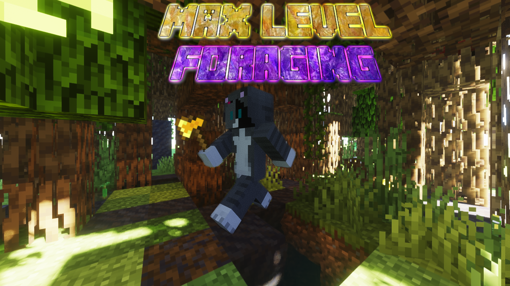
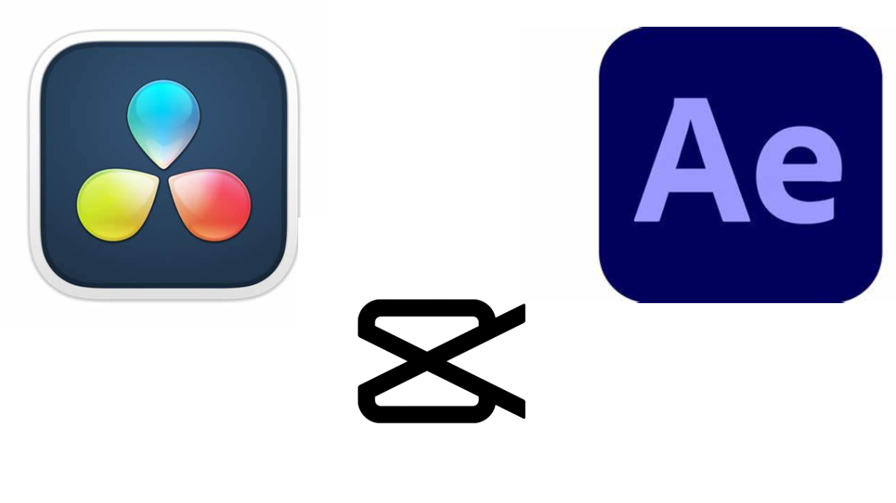

<!DOCTYPE html>
<html lang="en">
  <head>
    <meta name="viewport" content="width=device-width, initial-scale=1">
    <title>Retros File Packs</title>
    <link href="https://fonts.googleapis.com/css2?family=Montserrat:wght@600&family=Roboto:wght@400;700&display=swap" rel="stylesheet">
    <link rel="icon" type="image/png" href="images/RFP_favicon.ico">
    
  </head>
  <body>
    

      <button class="bottom-btn" onclick="window.location.href='aboutme.html'">Go to About Me</button>
      <button class="bottom-btn" onclick="window.location.href='downloadspage.html'">Go to Downloads</button>
    

<body>
  <header>
    <h1>Stuff Currently Listed</h1>
    
Download Or Learn below

  </header>
  <main>
    

      
      

        Thumbnail Editing
        <h2 class="card-title">How I Make My Thumbnails</h2>
        

         I Will Teach You How I Make My Thumbnails For The Videos I Create.
        

      

    

    

      
      

        Video Editing
        <h2 class="card-title">Learn My Style Of Editing</h2>
        

          This Will Teach You How I Edit My Videos And The Tools I Use To Create Them.
        

      

    

    

      
      

        Recording
        <h2 class="card-title">How I Record Videos</h2>
        

          A Quick Guide On How I Record My Videos And What Software I Use, What I Also Recommend.
        

      

    

    <!-- Add more cards or replace image src as needed -->
  </main>
  <footer>
    &copy; 2025 RetrosFilePacks | Designed BY Retro
  </footer>
</body>
</html>
